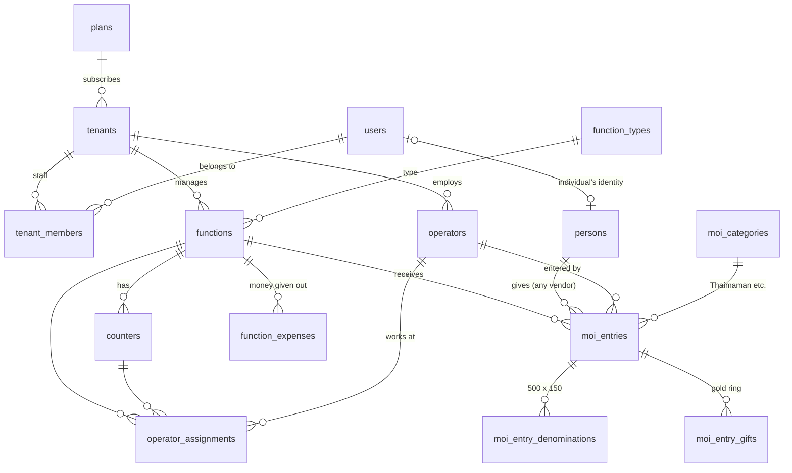

# OneMoi — Database (PostgreSQL)

Local: **PostgreSQL 18**, database **`onemoi`**, user `postgres`, port 5432.
Connection string: `src/backend/OneMoi.Api/appsettings.json → ConnectionStrings:OneMoi`.

The tables are created by EF Core migrations (`src/backend/OneMoi.Infrastructure/Persistence/Migrations`). The same SQL is in `database/01_create_database_schema.sql`.
All names are **lower_snake_case**, so in pgAdmin you can write `select * from moi.moi_entries;` without quotes.

| Schema | Purpose | Tables |
|---|---|---|
| `auth` | logins & security | users, otp_requests, refresh_tokens, notification_logs, audit_logs |
| `core` | Moi vendors (tenants) | plans, tenants, tenant_members, operators |
| `master` | lookup lists | function_types, moi_categories, gift_item_types, expense_categories, denominations |
| `evt` | functions | functions, counters, operator_assignments |
| `moi` | money | persons, moi_entries, moi_entry_denominations, moi_entry_gifts, function_expenses |

C# property → column: `NameTa` → `name_ta`, `CreatedAt` → `created_at`, `IsDeleted` → `is_deleted`.

## Relationships



## Rules built into the tables

| Rule | How |
|---|---|
| Tamil stored correctly | UTF-8 database; every name has an English and a Tamil column (`name / name_ta`, `spouse_name / spouse_name_ta`, `city / city_ta`, `location / location_ta` …) |
| One mobile = one person | unique partial index on `moi.persons.mobile` (where not deleted) |
| Vendors never see each other | `tenant_id` on vendor tables + EF global query filter |
| Nothing is hard-deleted | `is_deleted` flag; Moi entries are **reversed** (`status = 2`, `reversal_reason`) |
| Who / when | `created_at, created_by, updated_at, updated_by` on business tables (`timestamp with time zone`) |
| Serial numbers per function | unique index `(function_id, serial_no)`; receipt = `VENDOR-FUNCTIONCODE-0001` |
| Safe re-send from devices | `moi_entries.client_ref` unique: the same request twice is saved once |
| OTPs are secret | `auth.otp_requests.code_hash` = HMAC-SHA256 of the code; max attempts, expiry, rate limit |
| Passwords / PINs | BCrypt hashes in `users.password_hash`, `operators.pin_hash` |
| Messages sent | `auth.notification_logs` (OTP masked as ******) |
| Case-insensitive search | searches use `lower(...)`, so "ram" finds "Ram" |

## Date & time columns

| Column | Type | Meaning |
|---|---|---|
| `functions.function_date` | `date` | the function day |
| `functions.start_time / end_time` | `time` | clock time |
| `operator_assignments.valid_from / valid_to` | `timestamp without time zone` | local (India) time window for operator login |
| `created_at`, `entry_at`, `expires_at`, `last_login_at` … | `timestamp with time zone` | exact moment (stored in UTC; pgAdmin shows it in your time zone) |

## Enum values stored as numbers

| Column | Values |
|---|---|
| `users.user_type` | 1 SuperAdmin · 2 TenantUser · 3 Individual |
| `tenant_members.role` | 1 Owner · 2 Manager · 3 Accountant |
| `tenants.status` | 1 Pending · 2 Active · 3 Suspended |
| `functions.status` | 1 Draft · 2 Scheduled · 3 Live · 4 Closed · 5 Cancelled |
| `moi_entries.payment_mode`, `function_expenses.payment_mode` | 1 Cash · 2 UPI · 3 Card · 4 Cheque · 5 Gift only |
| `moi_entries.status` | 1 Active · 2 Reversed |
| `otp_requests.channel` | 1 SMS · 2 E-mail |
| `otp_requests.purpose` | 1 Login · 2 Register · 3 Reset password · 4 Verify e-mail |

## Handy scripts (`database\`)

| File | Use |
|---|---|
| `01_create_database_schema.sql` | full schema (normally the API creates it for you) |
| `02_explore_data.sql` | 14 queries to understand the data: open in pgAdmin → Query Tool |
| `03_reset_demo_database.sql` | drop everything; the next API start recreates tables + fresh demo data dated today |

## Changing tables later

```bash
cd D:\OneMoi\src\backend
dotnet ef migrations add AddSomething --project OneMoi.Infrastructure --startup-project OneMoi.Api --output-dir Persistence/Migrations
dotnet ef database update --project OneMoi.Infrastructure --startup-project OneMoi.Api
```
(or VS Code → Terminal → Run Task → "EF: add migration" / "EF: update database")
